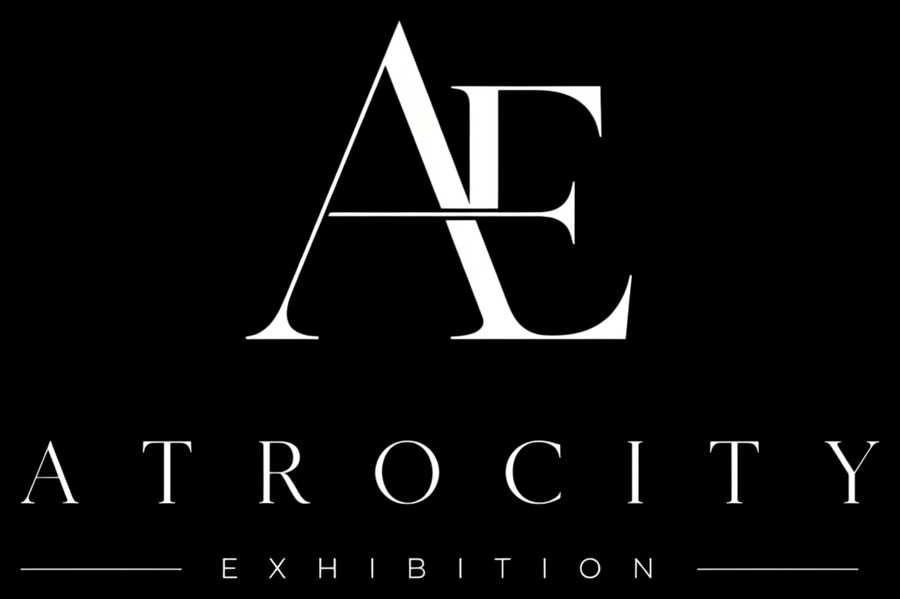

<div align="center">


**A C++17 / OpenGL game engine and scene editor for first-person games.**

[](https://en.cppreference.com/w/cpp/17)
[](https://www.khronos.org/opengl/)
[](#building)
[](#building)
[](LICENSE)

</div>

---

Tartarus is a from-scratch game engine with a full editor front-end — dockable panels,
transform gizmos, an asset browser, prefabs, undo/redo, and an in-editor play mode. It renders
imported FBX/glTF/OBJ models with PBR-style materials and skeletal animation through a
hand-rolled OpenGL 4.6 core loader, with no glad/Python codegen step in the build.

## Built with Tartarus

<div align="center">



</div>

**Atrocity Exhibition** is the first-person game being built on Tartarus — and the reason the
engine exists. Engine features get prioritised by what the game actually needs, which keeps
the roadmap honest.

<!-- STINGER: drag "Logo Intro 4k.mp4" into GitHub's README editor to embed it here.
     GitHub hosts the upload and renders a real video player; a raw repo path will not work. -->

## Features

### Editor

| | |
|---|---|
| **Dockable layout** | Scene, Game, Hierarchy, Inspector, Asset Browser, Console, Stats, and History panels in a real ImGui dock tree — drag any border to resize neighbours, panels scale proportionally with the window, and the arrangement persists between sessions |
| **Transform gizmos** | Translate / rotate / scale / rect tools with local vs. world space, pivot vs. bounds-center, a combined gizmo for multi-object selections, and a relative Batch Transform panel for nudging a whole selection at once |
| **Selection** | Click-to-pick, box/marquee select, `Ctrl`-click multi-select, hierarchy parenting, per-entity active toggle |
| **Snapping** | Grid snap (hold `Ctrl` to invert), configurable translate/rotate/scale increments, hold-`V` vertex snapping between meshes, and snap-to-ground |
| **Navigation** | Fly camera, Alt-orbit, pan, dolly, frame-selection, orthographic/perspective toggle, axis view presets with animated transitions, plus an on-screen orientation gizmo |
| **Undo / redo** | Whole-scene snapshots with a History panel you can jump around in |
| **Play mode** | Runs inside the docked Game panel with the editor still live; scene state is snapshotted on entry and restored on exit, so play never becomes an edit. Click to capture input, `Esc` to release, and a fullscreen toggle for the whole window |
| **Game View** | Resolution and aspect-ratio presets with letterboxing, custom resolutions, maximize-on-play, and an FPS/draw-call/triangle overlay. Add a **Camera** entity to frame a shot — the Game view previews through it while editing |
| **Quality of life** | Auto-save, copy/paste/duplicate, filtered console, statistics overlay, DPI-aware scaling, persisted preferences |

### Assets

- **Import** FBX, OBJ, glTF/GLB models · PNG/JPG/TGA/BMP textures · WAV/MP3/OGG/FLAC audio
- **Browse** with a folder tree, resizable icon grid or compact list, search, and labels
- **Drag and drop** — from the OS into the editor, or from the browser into the viewport with a live translucent placement preview that grid-snaps and rests on the surface below
- **Import settings** per asset (Unity-style): texture filtering, wrap, sRGB, mipmaps, max size; model scale, normals, tangents, skeleton, animation, and material handling — all re-importable in place
- **Previews** including live texture thumbnails, an orbitable 3D model preview, and R/G/B/A channel isolation for textures
- **Prefabs** — save an entity as a reusable asset and instantiate it by drag or double-click

### Renderer

- Forward PBR-style shading — albedo, normal, metallic, roughness, ambient occlusion, and emissive maps
- **Linear HDR pipeline** — the scene renders into a multisampled `RGBA16F` target and a single fullscreen pass applies exposure, a tone-mapping curve (**Reinhard / ACES / AgX**), and gamma
- **Directional, point, and spot lights** in one GPU light buffer (`std430` SSBO) — the sun is a placeable entity you aim with its rotation; point/spot have range and cone falloff, and each light has a per-entity **Cast Shadows** toggle
- **Cascaded shadow maps** for the directional sun — 2–4 texel-snapped cascades, soft rotated-Poisson PCF whose penumbra follows the sun's angular size, seam-blended between cascades, with per-cascade frustum culling
- **Point-light shadows** via a depth cube-map array, and **spot-light shadows** via a perspective depth array — both store linear distance-to-light so a shadow reaches the light's full range, and share the light SSBO's per-light shadow slot
- Skeletal animation with up to 100 bones per model
- Frustum culling, a redundant-state-change cache, and per-frame draw statistics
- Offscreen HDR targets per viewport, so Scene and Game render independently at their own resolutions and MSAA levels
- Procedural sky, distance-faded infinite grid, inverted-hull selection outlines, translucent drag previews
- Shaded / wireframe / unlit view modes
- Targets OpenGL 4.6 core through the hand-rolled loader — immutable texture storage and `std430` shader storage buffers today, with the mesh path moving to direct state access next

### Core

- **EnTT** entity-component system with a full transform hierarchy
- JSON scene serialization, including the asset library and per-asset import settings
- First-person controller — WASD, sprint, jump, gravity, and sub-stepped AABB collision that won't tunnel through thin geometry
- AABB physics primitives with ray/box intersection for hitscan queries
- Audio playback and in-editor preview via miniaudio
- Frame profiler, and a log that streams into the editor Console

## Tools

### TifSplitter

A standalone command-line utility (built alongside the engine as its own executable) that turns
high-bit-depth or multi-channel TIFFs into the 8-bit PNGs the engine's texture loader reads.
Decoding goes through libtiff, so any source layout it supports works — 8/16/32-bit integer or
float samples, tiled or stripped, palette, YCbCr, CMYK.

| | |
|---|---|
| **Channel splitting** | Unpack a combined sheet into `_R` / `_G` / `_B` / `_A` PNGs — e.g. a Metallic / Roughness / AO / Smoothness texture authored as one RGBA image |
| **Normal map conversion** | Flip green to convert a DirectX (+Y up) normal map to OpenGL (+Y down), which is what the engine's shaders expect |
| **Heightmap normalization** | Stretch a 16-bit heightmap's actual value range to fill 0–255, so terrain data that only occupied a narrow slice of its range doesn't decode to flat gray |
| **Tiling** | Split an oversized source into a grid of square PNGs, for terrain too large to load as a single texture |
| **Batch mode** | Convert a whole folder (optionally recursive, mirroring its structure) or an explicit file list, across multiple threads |

```bash
# One file, splitting a packed PBR sheet into its channels
TifSplitter -i packed_mrao.tif -o ./Output --split-channels

# A whole tree, converting DirectX normal maps as it goes
TifSplitter -d ./SourceTextures --recursive -o ./Output --flip-y

# A heightmap too big for one texture, cut into 1024px tiles
TifSplitter -i Terrain_Height.tif -o ./Output --tile-size 1024
```

Run it with no arguments for the full option list, or drag a `.tif` onto the executable to
convert it in place.

## Building

Requires **CMake 3.16+**, an **MSVC** toolset (Visual Studio 2022 or newer), and a GPU/driver
that can create an **OpenGL 4.6 core** context (any NVIDIA/AMD/Intel driver from the last
several years). GLFW, GLM, Assimp, EnTT, Dear ImGui, and ImGuizmo are fetched automatically by
CMake on first configure — that step needs an internet connection; later builds are offline.

```bash
cmake -S . -B build -G "Visual Studio 17 2022" -A x64
cmake --build build --config Release
```

The executable lands at `build/Release/TartarusEngine.exe`. Icon fonts and branding are copied
next to it automatically by a post-build step — no other assets or DLLs required. On first
launch it opens `project/scenes/Showcase.json` — a first-person hall lit entirely by moving,
colour-cycling point and spot lights — and thereafter reopens whatever scene you last had open.

> **Note:** the engine must be closed before rebuilding, or the linker can't overwrite the exe.

## Controls

| Input | Action |
|---|---|
| `Right-drag` | Look around · `WASD` `Q` `E` to fly while held · `Shift` to sprint |
| `Alt` + `Left-drag` | Orbit the selection |
| `Alt` + `Right-drag` / `Scroll` | Dolly / zoom |
| `Middle-drag` | Pan |
| `W` `E` `R` `T` | Translate / Rotate / Scale / Rect tool |
| `F` | Frame the current selection |
| `V` (hold) | Vertex snap — grab a vertex and snap it onto another mesh |
| `Ctrl` (hold) | Invert grid snapping for the duration of a drag |
| `Numpad 1` `3` `7` `0` | Front / Right / Top / Isometric views · `5` toggles orthographic |
| `Ctrl` + `Z` / `Y` | Undo / Redo |
| `Ctrl` + `C` / `X` / `V` / `D` | Copy / Cut / Paste / Duplicate |
| `Ctrl` + `S` | Save scene |
| `F1` | Toggle play mode · `Esc` releases the cursor · `F11` fullscreen |

## Project layout

```
src/
  Core/       Window, input, clock, logging, profiler, project paths
  Renderer/   GL loader, shaders, models, meshes, textures, camera, framebuffers
  Game/       World (EnTT), player controller, scene serialization, components
  Editor/     Editor layer, asset library, panels, import pipeline
  Physics/    AABB, frustum
  Audio/      miniaudio wrapper
extern/       Vendored single-header libraries, icon font, branding
tools/        TifSplitter — standalone TIFF-to-PNG channel splitter
project/      The scene and editor preferences being authored
```

## Roadmap

**Shipped** — linear HDR pipeline with tone mapping · cascaded shadow maps for the sun · point- and spot-light shadows · GPU (SSBO) light buffer

**Next**

- Clustered / tiled light culling, so a fragment stops looping every light
- Screen-space effects on the HDR buffer — SSAO, bloom
- A behaviour/scripting layer, so entities can do more than sit still
- Project-relative asset pipeline with a baked import cache
- Standalone build export

## License

Released under the [MIT License](LICENSE).

Bundled and fetched third-party components (miniaudio, stb, nlohmann/json, Font Awesome, GLFW,
GLM, Assimp, EnTT, Dear ImGui, ImGuizmo, libtiff) remain under their own licenses — see
[THIRD-PARTY-NOTICES.md](THIRD-PARTY-NOTICES.md). Branding assets under `extern/branding/` are
not covered by the MIT license.

<div align="center">
<br>

</div>
