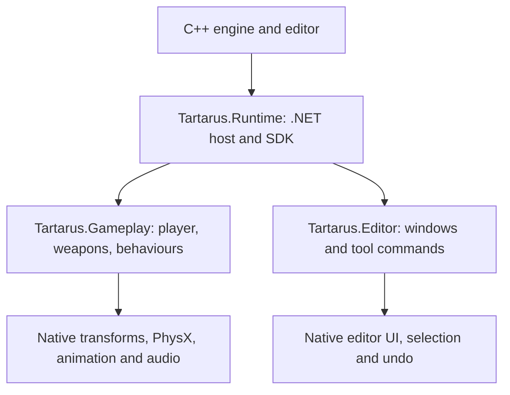

# Tartarus scripting manual

[Documentation index](README.md) · [API reference](SCRIPTING_API.md) ·
[Gameplay frame reference](SCRIPTING_FRAMES.md)

This manual explains how to author, attach, debug and ship C# gameplay and editor tools in
Tartarus. It describes the implemented behavior, including places where native systems still
own simulation or presentation. Examples are ordinary C# source files, editable in the
[embedded Script IDE](SCRIPT_IDE.md) or an external editor.

## Contents

1. [Architecture and where code belongs](#architecture-and-where-code-belongs)
2. [Installation and first script](#installation-and-first-script)
3. [Inspector fields and serialization](#inspector-fields-and-serialization)
4. [Multiple behaviours and object lifetime](#multiple-behaviours-and-object-lifetime)
5. [Physics and named input](#physics-and-named-input)
6. [Prefab and AK/870 workflow](#prefab-and-ak870-workflow)
7. [Customizing player and weapon gameplay](#customizing-player-and-weapon-gameplay)
8. [Native component data](#native-component-data)
9. [C# editor tool tutorial](#c-editor-tool-tutorial)
10. [Hot reload and saved state](#hot-reload-and-saved-state)
11. [Builds and exports](#builds-and-exports)
12. [Troubleshooting](#troubleshooting)
13. [Practical development checklist](#practical-development-checklist)

## Architecture and where code belongs

Tartarus has three managed assemblies. `Tartarus.Runtime` is the stable host/SDK, pinned by
.NET. `Tartarus.Gameplay` contains the project's gameplay and attached behaviours.
`Tartarus.Editor` contains editor tools and compiles separately. The latter two load into
separate collectible assembly contexts so a source edit can replace their code.



| Task | Where to work |
| --- | --- |
| Add behavior to a placed object | A `MonoBehaviour` under `project/assets/Scripts` or another non-Editor asset folder. |
| Change default player movement | `project/assets/Scripts/PlayerController.cs`. |
| Change AK/870 fire, reload, chamber or pellet rules | `project/assets/Scripts/WeaponController.cs`. |
| Route the built-in gameplay callbacks | `project/assets/Scripts/Gameplay.cs`, the project's `IProjectIntegration` implementation. |
| Add an editor window or command | A C# source below an assets folder named `Editor`. |
| Change an animator graph or recoil curve | The corresponding native controller/descriptor/recoil asset and existing editor UI. |
| Add a native engine binding | Runtime SDK plus C++ service bridge; rebuild and restart. |

A `MonoBehaviour` is an attached object behavior. The supplied player and weapon controllers
are invoked through `IProjectIntegration` frames because the camera, player capsule and equipped weapon
rigs have existing native lifetimes. Do not attach another player movement controller merely
to enable the default player. `IProjectIntegration` already invokes it.

Use `using Tartarus;` and `using System.Numerics;`. For editor code, also import
`Tartarus.Editor`. A Tartarus class named `MonoBehaviour` supplies familiar lifecycle methods;
it does not provide UnityEngine, Unity packages or Unity's complete serialization system.

## Installation and first script

### Prerequisites

Install the **x64 .NET 10 SDK** for script compilation. Exported games need the x64 .NET 10
runtime. These are framework-dependent builds; the host does not bundle the entire CLR.
The native engine toolchain remains the repository's CMake/MSVC configuration.

From the repository root, these commands build the available scripting projects:

```powershell
dotnet --list-sdks
dotnet --list-runtimes
cmake --build build --config Release --target TartarusScripts
```

The sample workspace builds its scripts with `TartarusEngine`;
`TARTARUS_BUILD_SAMPLE_GAME=OFF` makes the engine depend only on `TartarusRuntime`. If changing native bindings, build it
instead and restart the editor. If only editing a project script, use the save/build workflow.

### Make an object rotate

1. In the Asset Browser, choose **Create C# Script**.
2. Name the source/class `Rotator`. Keep it outside an Editor folder.
3. Replace the source with the following complete class and save it.
4. Wait for compilation. Drag the file onto a scene object, or add C# Script and choose its type.
5. Set DegreesPerSecond in the Inspector and press Play.

```csharp
using System.Numerics;
using Tartarus;

namespace Tartarus.Gameplay;

public sealed class Rotator : MonoBehaviour
{
    [Range(-360, 360)] public float DegreesPerSecond = 45;
    public Vector3 Axis = Vector3.UnitY;

    public override void Update()
    {
        transform.Rotate(Axis, DegreesPerSecond * Time.deltaTime);
    }
}
```

The fully qualified class is `Tartarus.Gameplay.Rotator`. A `.cs` filename is an editor source
link; the runtime resolves the compiled class name. Keeping the filename and class name equal
makes drag/drop setup easier. If using a different namespace or several classes in one file,
choose the intended compiled type in the Script dropdown.

Saving `.cs` or `.csproj` source schedules compilation after a 600 ms debounce. Saves during
a build schedule another build. You can force it through **File > Build C# Gameplay & Editor**.
New scripts and double-clicked `.cs` assets open in the embedded Script IDE. **Open Externally**
is available in the Asset Browser context menu. The IDE also provides live Problems, semantic
completion/navigation, rename previews and source recovery; see [SCRIPT_IDE.md](SCRIPT_IDE.md).

### What to expect while editing

* Public supported fields appear as controls after the compiled type is available.
* A syntax error appears in the Console and the build log; existing compiled code stays loaded.
* Changes to script code can reload during Play.
* Stopping Play restores the authored scene. Runtime movement does not become a saved transform.
* Disabling a script stops its callbacks but keeps its instance; it does not reset the object.

## Inspector fields and serialization

The Inspector exposes public writable fields and private fields marked `[SerializeField]`.
Supported types are float, int, bool, string, Vector3 and enums backed by int.

```csharp
using Tartarus;

namespace Tartarus.Gameplay;

public enum DoorMode { Closed = 0, Open = 4 }

public sealed class DoorSettings : MonoBehaviour
{
    public DoorMode Mode;
    [Range(0, 20)] public float OpenSpeed = 3;
    [SerializeField, Tooltip("Retained through code reload")]
    private bool locked = true;
    [SerializeField, HideInInspector] private int interactionCount;

    public bool IsLocked => locked;
    public void Unlock() => locked = false;
    public void RegisterInteraction() => ++interactionCount;
}
```

`Range` selects a slider; it is a UI hint rather than a general guarantee that every C#
assignment is clamped. `Tooltip` adds help. `HideInInspector` hides serialized state while
keeping it in the default hot-reload snapshot. Private unmarked fields, static fields,
readonly fields, properties and `[NonSerialized]` fields are not serialized by this mechanism.

The native component stores field overrides internally as JSON. Use Inspector controls rather
than editing that JSON manually. Scene save/load, clipboard, undo and prefab overrides carry
the script configuration. Field names are the schema: changing `OpenSpeed` to `Speed` removes
the previous override and uses the new field's default. There is no automatic rename-migration
attribute. Avoid duplicate serialized field names in an inheritance hierarchy.

Collections, typed object-reference fields and custom structs are not Inspector field types yet.
String fields can use `[SceneReference("Transform", true)]` or
`[SceneReference("Particle System", true)]` for hierarchy pickers and drag/drop. These store
paths relative to the script's object; the second argument restricts selection to its subtree.
`[SoundReferences]` supplies audio asset slots stored as semicolon-separated project paths,
and `[InspectorChoices("", "ak", "870")]` supplies a string dropdown. Relative scene paths
survive prefab instantiation but depend on hierarchy names and placement; they are not stable
object GUIDs. Keep other unsupported values as runtime C# state.
For custom hot-reload state, override SaveState and LoadState as explained later.

## Multiple behaviours and object lifetime

An object can carry several script slots. Each gets its own fields, enabled flag and stable
object-local InstanceId. Two instances of Rotator are independent. Do not assume script slot
order provides an execution priority between objects.

`GetComponent<T>()` returns the first match or null. `GetComponents<T>()` returns all matches,
including disabled behaviours. Cache a component in Start when it is required repeatedly.
Reacquire after scene restoration; native entity IDs include generation bits and are not
permanent asset/scene identifiers.

```csharp
using Tartarus;

namespace Tartarus.Gameplay;

public sealed class AnimatorDriver : MonoBehaviour
{
    private Animator? animator;

    public override void Start()
    {
        animator = GetComponent<Animator>();
        if (animator == null) Debug.Log("AnimatorDriver needs an Animator on this object.");
    }

    public override void Update()
    {
        animator?.SetBool("Moving", Input.GetButton("Sprint"));
    }
}
```

Author a controller with the intended parameter. Setting a parameter does not create an
animation graph or load an arms rig. `Animator.CurrentState`, InState, HasTag and EventFired
query the last native base-layer evaluation.

### Lifetime sequence

At a scripting tick, configured instances are constructed first. Initial active scripts get
Awake/OnEnable, followed by Start before their first Update or FixedUpdate. LateUpdate follows
ordinary Updates. Awake and Start each run once per instance activation lifetime.

Disabling produces OnDisable and preserves state. Re-enabling produces OnEnable without
repeating Awake/Start. An inactive parent can suppress callbacks even when the slot's enabled
flag and child's activeSelf are true. Removing a script or destroying its object produces
OnDestroy for an initialized instance. New scripts/objects created during callbacks join the
schedule at the next tick.

Use `gameObject.AddScript<MyBehaviour>()` to append a behaviour at runtime. It returns a slot
ID; construction occurs at a later scripting tick, so immediate GetComponent is not a promise
that the new managed instance already exists. Use RemoveScript with an instance belonging to
the same object. Script slot IDs are distinct from entity IDs.

## Physics and named input

The engine uses named input actions from Project Settings > Input. Use GetButtonDown for a
one-shot action, GetButton for held state, GetButtonUp for release, and GetAxis for analog
values. Read transitions in Update and preserve a request for FixedUpdate to consume.

### A dynamic-body impulse example

Place a native Rigidbody and Collider on an object before entering Play. Make the body
dynamic. Attach this script and configure a `Jump` input action:

```csharp
using System.Numerics;
using Tartarus;

namespace Tartarus.Gameplay;

public sealed class ImpulseJump : MonoBehaviour
{
    public float Impulse = 5;
    private Rigidbody? body;
    private bool requested;

    public override void Start() => body = GetComponent<Rigidbody>();

    public override void Update()
    {
        if (Input.GetButtonDown("Jump")) requested = true;
    }

    public override void FixedUpdate()
    {
        if (!requested) return;
        requested = false;
        body?.AddForce(Vector3.UnitY * Impulse, ForceMode.Impulse);
    }
}
```

This example has no grounded check; it demonstrates scheduling and allows impulses in midair.
The supplied PlayerController has its own grounding, jump-buffer and coyote-time logic.
Continuous Force/Acceleration should be applied in FixedUpdate. Impulse and VelocityChange
are instantaneous modes. Physics owns the pose of a simulated dynamic body; use its motion
services rather than expecting a transform edit to permanently override the simulation.

### Query an object in front of you

```csharp
using Tartarus;

namespace Tartarus.Gameplay;

public sealed class RayInspector : MonoBehaviour
{
    public float Distance = 10;

    public override void Update()
    {
        if (!Input.GetButtonDown("Inspect")) return;
        if (Physics.Raycast(transform.position, transform.forward, out var hit, Distance))
            Debug.Log($"Hit {hit.Object.name} at {hit.Distance:0.00} units");
    }
}
```

Configure the Inspect action. Engine forward is **-Z**, unlike Unity's +Z transform convention.
Queries require an active physics scene and native collider actors. Layer masks use bit N for
layer N; triggers are ignored by default. SphereCast provides a swept-radius query.
OverlapSphere returns a bounded snapshot, with a default cap of 128 and maximum cap of 4096.

Runtime native actor creation/rebuilding is not supplied by generic component authoring.
Scene.Create produces an empty transform object; adding a collider after Play starts is not
a supported way to manufacture an active PhysX actor. Set up bodies and colliders in Edit mode.

## Prefab and AK/870 workflow

The default weapon prefabs are:

* `assets/Weapons/AKS74U/AKS74U.prefab`
* `assets/Weapons/Remington870/Remington870.prefab`

Weapon assets may be licensed/local project content rather than part of a distributable
sample. The project-owned `Tartarus.Gameplay.WeaponDefinition` C# script in
`assets/Scripts/WeaponDefinition.cs` stores a description, `.fpsanim` asset reference and muzzle
settings. It replaces the former native Weapon Definition component; older prefab/scene data
converts on read and saves as an ordinary C# script without discarding other script slots.
That set bundles rigs, animator/controller settings, recoil, shake, sound identity and
gameplay values. The native presentation path constructs the camera-bound first-person rigs.

### Configure the player's weapon slots

1. Select the object with First Person Controller.
2. Set **Primary Weapon Prefab** to the AK prefab and **Secondary Weapon Prefab** to the 870.
3. Use the corresponding Animation Set fields only for legacy descriptor-based setups.
4. Enter Play and switch slots through configured input actions.

A supplied prefab takes priority over the legacy Animation Set field for that slot. Dropping
a weapon prefab into a scene creates its ordinary scene instance; assigning the player slot
selects the camera-bound equipped presentation. Those are different native uses of the asset.

### Shared setup and shotgun differences

The 870 uses the AK's general aim/IK/camera/lean/obstruction/locomotion setup with its own
clips and authored recoil/shake/sights/mount/sounds. Shotgun-specific behavior remains:
6 shells, 8 pellets, semi-only fire, pumping after a committed shot, and interruptible per-shell
reload. Edit descriptor settings instead of adding hardcoded weapon-name branches for tuning.

Use Prefab Mode for shared changes, instance overrides for scene-specific changes, and the
existing Apply/Revert controls to manage them. Script classes, fields and slot configuration
can live on prefabs. Compiled code is shared by type; per-instance Inspector values remain
separate. Changing a script's source changes its behavior everywhere that class is attached.

See [weapon integration](FPS_WEAPON_INTEGRATION.md), [first-person animation](FPS_ANIMATION_SYSTEM.md),
[recoil](PROCEDURAL_RECOIL.md) and [animator](ANIMATOR.md) for the native asset workflows.

## Customizing player and weapon gameplay

`Gameplay.cs` implements IProjectIntegration and delegates to the supplied controllers. The assembly
may contain zero or one concrete IProjectIntegration implementation. Ordinary object scripts
do not need a dispatcher. Adding a second implementation
causes load/reload validation to fail. Modify the existing implementation when changing routing.

### Player configuration versus behavior

Use project PlayerDefinition fields for authored movement speed, gravity, capsule size, sprint,
crouch and jump tuning. Use PlayerController.cs when changing the algorithm itself. Its
PlayerFrame is a per-call data contract: configuration comes in, motion state comes back out.
Some configuration fields are copied when the native player is initialized; editing authored
data during Play does not imply every existing native object will be reconstructed.

For example, the controller currently suppresses sprint while aiming or crouched. To alter
that rule, edit the `sprint` condition in PlayerController.Update. To alter acceleration,
edit Approach or its target-selection logic. Keep ground detection, platform yaw, crouch fit
and respawn behavior in mind when replacing movement rather than modifying one rule.

### Weapon operations

The native presenter calls WeaponController.Update with one WeaponOperation at a time. Each
call clears Commands and Result, evaluates the request, and sends updated state back.

| Operation | Why it is called |
| --- | --- |
| RequestFire | Decide whether the weapon can fire and whether to commit now or trigger animation. |
| CommitShot | Consume ammunition and begin shotgun cycling after the shot actually occurs. |
| CheckTrigger | Decide whether pressed/held input or burst state wants another firing attempt. |
| TriggerResult | Set cadence and burst continuation after a firing attempt. |
| RequestReload | Start reload when eligible. |
| ToggleFireMode | Toggle auto/semi if the descriptor permits auto. |
| Tick | Advance cooldown, pump timing and idle fidget state. |
| AnimationEvents | Commit magazine/shell loading from authored events. |
| ReloadButton | Distinguish reload tap from a held magazine check. |

Do not consume ammunition twice by handling both RequestFire and CommitShot as a shot commit.
Do not repeat an animation-triggered shot merely because Update runs again. Busy/reload/cycle
tags and chamber state are part of the contract. The 870 only chambers again after its pump
state has been observed and completed. Matching animator events matters as much as the C# rule.

ShotFrame drives pellet spread and impact rules. Its RandomSeed makes a shot's generated
pellet directions repeatable. The current controller distributes capped impulse across
pellets; changing that division changes the total force applied by a shotgun blast.
See [the complete field reference](SCRIPTING_FRAMES.md) before modifying ABI state.

### Changing the native/managed contract

Changing only algorithm code does not require an ABI edit. Adding/reordering frame fields
does: edit `tools/generate_game_frames.py` for private FPS frames and regenerate both
language definitions, then rebuild native plus managed code and restart. Engine lifecycle/service
ABI changes use `tools/generate_script_abi.py` and its version. Do not edit generated layouts
independently. Native dispatch checks frame byte sizes/version before reading memory.

## Native component data

Typed wrappers cover common components; `ComponentCatalog.GetAll()` exposes every registered
native component's reflected fields. The catalog gives stable keys, labels, types, bounds,
tooltips and enum labels. NativeComponent.Get/Set uses this authored-data interface.

To discover keys, use the supplied Scene Tools **Log scripting API catalog** command, or log
each field's Key and Tooltip. Prefer stable keys in production code over display labels.
Native enum values are indices into EnumLabels; serialized native scene JSON can use a
different representation, so do not treat raw scene JSON as the API protocol.

Use exact value types: bool, int, float, string and Vector3. Wrong types/missing objects or
fields are errors. Native field bounds clamp valid numeric writes when configured. Native data
changes can be read back even if a subsystem copies those values only at initialization.

Adding/removing native components is an **Edit mode authoring** operation. The API rejects
structural changes during active physics. Mesh Renderer requires native asset/model setup;
instantiate authored prefabs for models. Use AddScript/RemoveScript instead of editing the
internal C# Script slot blob through generic data writes.

## C# editor tool tutorial

Choose **Create C# Editor Script**, or create a `.cs` file under `assets/Editor`. Derive from
EditorWindow. It is discovered independently of gameplay and opened from **C# Tools**.
The native editor owns the actual dockable ImGui window; C# supplies its content and commands.

### An undoable camera-creation tool

```csharp
using System.Numerics;
using Tartarus;
using Tartarus.Editor;

namespace Tartarus.EditorTools;

public sealed class CameraMaker : EditorWindow
{
    private Vector3 position = new(0, 2, 5);
    private float fieldOfView = 60;
    public override string Title => "Camera Maker";

    [MenuItem("Scene/Open Camera Maker")]
    public static void OpenTool() => GetWindow<CameraMaker>();

    public override void OnGUI()
    {
        EditorGUILayout.Vector3Field("Position", ref position);
        EditorGUILayout.Slider("Vertical FOV", ref fieldOfView, 1, 179);
        if (EditorUtility.IsPlaying) {
            EditorGUILayout.Label("Stop Play before creating an authored camera.");
            return;
        }
        if (!EditorGUILayout.Button("Create camera")) return;

        Undo.RecordScene("Create camera from C#");
        var created = Scene.Create("Tool Camera", position);
        created.AddComponent<Camera>().fieldOfView = fieldOfView;
        Selection.activeGameObject = created;
    }
}
```

Undo.RecordScene records the pre-command scene/asset state. Call it once before the first
mutation, not after the edit and not on every draw. Selection is a separate native editor
service. For continuous slider-driven scene edits, design a deliberate commit button or a
tool-specific interaction transaction; the current managed API does not expose every native
staged-undo drag helper.

MenuItem commands must be static void with no parameters. Their paths appear as command
buttons in C# Tools; they are not injected into the native top-level menu. GetWindow<T>() opens
the existing discovered tool instance. Close() closes the panel without unloading its code.

Tool OnEnable runs at assembly load, OnDisable at replacement/unload. Update runs every editor
draw even if the panel is closed. OnGUI runs when open and visible. OnSelectionChanged and
OnPlayModeChanged observe transitions on editor draws. GUI calls belong in OnGUI or a drawn
menu command, not Update, constructors or background tasks.

The host scopes widget IDs by window and order, balancing native Begin/End when a tool throws.
Keep widget order stable during a drag. A failed tool is logged and suspended until source
reload; the C# Tools panel displays its failure notice. Default editor-window hot-reload state
is empty; override SaveState/LoadState for tool fields that should survive a rebuild.

## Hot reload and saved state

There are three distinct kinds of state:

| State | Persistence |
| --- | --- |
| Authored scene/prefab overrides | Written through normal scene/prefab save and restored on Stop. |
| Runtime script instance fields | Kept while disabled; supported serialized fields copied during successful hot reload. |
| Native simulation state | Remains owned by the native Play session; not automatically reset by a script DLL rebuild. |

Default Script.SaveState includes supported serialized fields, including hidden private
serialized values. Replacement instances are constructed, saved state is applied, and the
runtime swaps only after candidate validation succeeds. Awake/Start are not repeated merely
because a successful hot reload occurred. Do not perform native mutations in constructors.

### Preserve a custom runtime counter

```csharp
using System.Text.Json;
using Tartarus;

namespace Tartarus.Gameplay;

public sealed class CounterState : MonoBehaviour
{
    private int ticks;
    public override void Update() => ++ticks;
    public override string SaveState() => JsonSerializer.Serialize(ticks);
    public override void LoadState(string json) => ticks = JsonSerializer.Deserialize<int>(json);
}
```

This deliberately replaces default field-state preservation for this class. If you also need
supported Inspector fields, include `base.SaveState()` in your own state envelope and call
`base.LoadState()` when reading it. Custom SaveState/LoadState must agree on schema and handle
your own version changes. Failure rejects the replacement assembly rather than silently losing
the previous running code. Static caches of old script instances/Types can prevent unloading.

## Builds and exports

Use CMake for engine/SDK changes. Use the background source build for ordinary gameplay/tools.
For direct builds from this repository root:

```powershell
dotnet build project/Scripts/Tartarus.Gameplay.csproj --configuration Release --output project/Scripts/bin --configfile NuGet.Config
dotnet build project/Scripts/Tartarus.Editor.csproj --configuration Release --output project/Scripts/bin --configfile NuGet.Config
```

Packaged editors pass their relocated `RuntimeProject` SDK path automatically. The csproj's
default repository-relative reference is not a universal installed SDK location.

Each project gets its own intermediate directory. Gameplay excludes Editor source. Game
exports exclude editor source and the editor assembly, select newer project gameplay output
over older staged output, and include managed runtime files. Runtime dependencies and native
asset setup still belong to the normal export pipeline. Do not hand-copy only the gameplay DLL
and expect an otherwise empty folder to be a runnable game.

For a short integration check, use `TartarusEngine.exe --unit-tests Managed`. It checks real
native/managed calls and editor command dispatch with a fake widget host. It does not visually
test docking, listen to audio or run the long animated weapon playtest. Documentation-only edits
do not require rebuilding or running the full gameplay suite.

## Troubleshooting

| Symptom | Likely cause and next action |
| --- | --- |
| .NET runtime not found | Check x64 .NET 10 installation and configured DOTNET_ROOT variables. |
| Saving does not update behavior | Wait for the build; inspect gameplay/editor logs; confirm the running editor uses this project. |
| Compiler error, old behavior continues | Expected rollback behavior. Fix the first compiler error and save again. |
| Script dropdown is empty | Gameplay assembly/type not compiled; inspect build.log and class inheritance. |
| Dragged script has an unavailable type | Correct its qualified class in the dropdown/Advanced Class; filename alone does not define a namespace. |
| Field not visible | Check supported type, public/private SerializeField, HideInInspector, readonly/static/property usage. |
| Renamed field lost its value | Field names are keys; transfer the authored value manually or write a deliberate migration. |
| Update never runs | Check slot enabled, object/parent activity, Play state, overrides and prior callback exceptions. |
| Start seems to repeat | Source reload alone preserves flags; removal/re-attachment or scene recreation creates a new lifetime. |
| GetComponent returns null | That object lacks the required native component/script, or a new script has not joined the next tick yet. |
| Native object operation fails | Check IsValid after deletion, undo, scene load or Play/Stop; reacquire a handle. |
| No physics query hits | Check Play/Physics.IsActive, authored colliders, direction, mask, range and trigger filtering. |
| Velocity read fails | Body absent, physics scene inactive, or not a valid active dynamic body. |
| Edited collider/mass has no live effect | Reflected authored data does not rebuild an existing actor. Stop, author and restart Play. |
| Animator parameter has no visible effect | Controller/state/transition does not consume it, graph is missing, or event timing differs. |
| 870 pump/reload gets stuck | Check Cycling/Reload tags, authored event names, chamber state and descriptor mode before changing code. |
| Edited weapon descriptor does not rebuild equipped rigs | Presentation setup may already be initialized; restart Play for structural asset changes. |
| Editor tool missing | Place code in an Editor folder, derive EditorWindow and inspect editor-build.log. |
| Editor tool stops drawing after an error | Check Console; fix/save source to reload. |
| MenuItem rejected | It must be a static void method with zero parameters. |
| Undo does not restore tool changes | Record the scene before mutation; ensure the command is an authored scene edit. |
| Tool's private state resets on rebuild | EditorWindow defaults to empty reload state; implement SaveState/LoadState. |
| Engine service called from worker thread | Compute plain data off-thread and consume it in a main-thread callback. |
| Two concrete IProjectIntegration implementations | Retain one dispatcher implementation; use separate ordinary helper classes. |
| New native binding unavailable after source rebuild | Rebuild engine/SDK and restart; Tartarus.Runtime is pinned. |
| Exported game runs older code | Complete the script build and export again; inspect selected gameplay DLL output. |

## Practical development checklist

1. Decide whether the change belongs to attached behavior, built-in gameplay routing, editor
   tooling, or native asset/presentation setup.
2. Keep source/class/namespace relationships clear and constructors free of engine effects.
3. Use supported serialized fields for authored values and explicit state for reload needs.
4. Cache required components in Start and handle absent/deleted objects.
5. Read input in Update, apply continuous physics forces in FixedUpdate, and author actors
   before Play.
6. Record undo before editor commands mutate authored scene data.
7. Inspect the relevant compiler/runtime error before adding unrelated code changes.
8. Verify the specific behavior affected. Use focused checks rather than the long playtest
   for every small edit.

See [SCRIPTING_API.md](SCRIPTING_API.md) for the exact implemented method surface and its
boundaries. See [SCRIPTING_FRAMES.md](SCRIPTING_FRAMES.md) for every gameplay frame field.

See [EDITOR_HISTORY_AND_INSPECTORS.md](EDITOR_HISTORY_AND_INSPECTORS.md) for global undo, recoil windows, custom Inspectors and serialized property APIs.

The embedded C# editor is documented in [SCRIPT_IDE.md](SCRIPT_IDE.md), including shortcuts, semantic navigation, save-to-compile, recovery and conflict handling.
